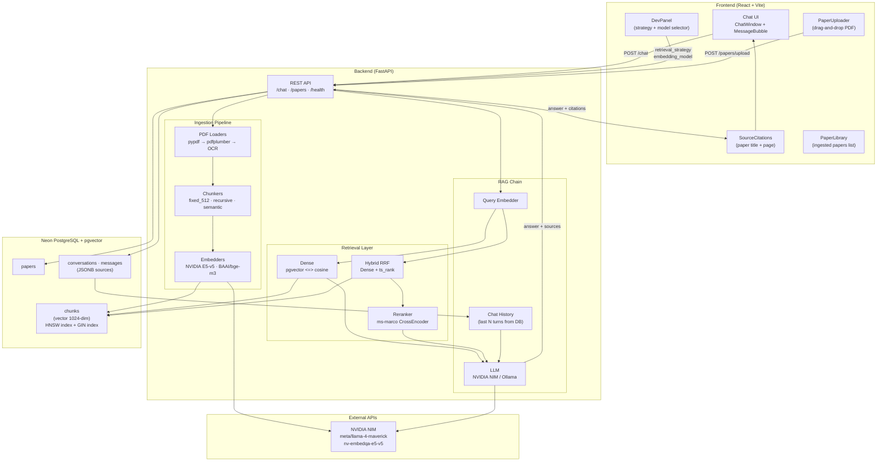

# Architecture Diagram — Research Paper Answer Bot

## End-to-End Architecture

## Component Summary

| Component | Technology | Purpose |
|---|---|---|
| **Frontend** | React 18 + Vite + Tailwind | Chat UI, paper management, dev panel |
| **API** | FastAPI + Pydantic | REST endpoints, validation, CORS |
| **Ingestion** | pypdf + pdfplumber + tiktoken | PDF → pages → chunks |
| **Embedders** | NVIDIA API + sentence-transformers | Dual-model embedding for comparison |
| **Vector Store** | Neon PostgreSQL + pgvector | Dense cosine search (HNSW) |
| **Full-text** | Postgres tsvector + GIN | BM25-equivalent keyword search |
| **Retrieval** | Custom Python | Dense / Hybrid RRF / CrossEncoder rerank |
| **LLM** | NVIDIA NIM (ChatOpenAI) | Answer generation |
| **Memory** | PostgreSQL messages table | Conversational history |

## Why PostgreSQL over Chroma/FAISS?

1. **One data store** — relational + vector + full-text in a single system. No sync between a metadata store and a separate vector index.
2. **Native hybrid search** — pgvector `<=>` + `ts_rank` combined in a single SQL query via RRF. No external BM25 server needed.
3. **Production-realistic** — Neon is a serverless Postgres; this architecture scales to production without replacing any component.
4. **Auditable** — every query, answer, retrieval strategy, and embedding model is logged in the `messages` table as JSONB for reproducibility.
